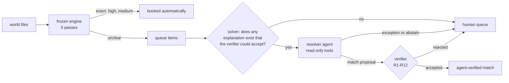

# Architecture

How the reconciliation works, where the AI agent sits, and where every number comes from. All numbers live in
committed files under [reports/](reports/) and regenerate offline with `python scripts/repro.py`.

## Words used here

- **Settlement**: one Razorpay payout (payments minus fee and tax) sent to the bank. It carries a **UTR**, the bank
  transfer reference, which is the strongest link between a settlement and a bank credit.
- **Paise**: every amount is an integer number of paise (₹1 = 100). No floats anywhere.
- **World**: one business's input files for a random seed (settlements, bank statement, payments, orders), plus its
  **golden files**: the answer key. The engine and the agent never read golden files; only the grader does.
- **Queue item**: a record the engine could not decide and left for a human.
- **Proposal**: the agent's one answer for a queue item: `match`, `exception` or `abstain`.
- **Verifier**: code that checks a proposal and shares nothing with the code that produced it.

## The data

`src/recon/generate.py` builds the project's own worlds (seed 42 is committed). The same author wrote the generator
and the engine, so scores on those worlds are a regression check, not evidence. `src/recon/holdout.py` builds the
held-out worlds used for the headline result; it was written by a separate agent that never saw the engine (see
"How it is measured"). `data/real/statement_a/` is one real personal bank statement with no Razorpay settlements in
it; it tests statement intake only.

## The engine: five passes

`src/recon/engine.py` is frozen at git tag `engine-frozen` (`tests/test_engine_frozen.py` pins its bytes). Each pass
only sees what earlier passes left unclaimed.

0. **Scope.** Debits are ignored. A credit counts as settlement-shaped if its narration or reference carries a
   Razorpay marker or something that looks like a UTR.
1. **Exact UTR.** The credit carries the settlement's UTR. Equal amounts match at `exact`. A gap explained by a known
   deduction (a ₹29.50 bank charge or 1% TDS) matches at `high`. Several credits with the same UTR are treated as
   duplicates or a split only if the amounts prove it; otherwise everyone abstains.
2. **Damaged UTR.** A long fragment of the UTR, or one character wrong, with an equal amount.
3. **Merges.** One credit that pays a settlement plus exactly one other open settlement.
4. **Unique exact amount.** No reference at all, but exactly one settlement and one credit share an amount within 10
   days. Any tie and everyone abstains.
5. **Residuals.** Whatever is left becomes an exception (settlement never reached the bank, credit with no
   settlement, or a credit that is not a settlement at all), with nearest-miss candidates for the human.

`exact`, `high` and `medium` (unique amount) are booked automatically. Everything else goes to the queue.

## The resolver: the agent proposes, the verifier disposes

**The solver** (`src/agent/solver.py`) runs before the agent. It is a bounded search over the open records for any
combination the verifier could accept (one credit paying up to 6 settlements, or one settlement split over 2 to 4
credits). If no such combination exists, the item is never sent to the model: no answer could pass anyway. If exactly
one exists, the solver alone could resolve it; that is the "no LLM" comparison row in the report.

**The agent** (`src/agent/resolve.py`) gets the queue item, the engine's evidence, and the open records nearby. Its
tools search an in-memory copy of the settlements, the bank statement and the merchant list; records the engine
already matched are left out. It gets one submission, no feedback, and at most 4 API calls.

**The verifier** (`src/agent/resolve_verifier.py`) uses only the standard library, reads the raw CSV files itself,
and checks all match proposals together after the run:

| Rule | A match is rejected unless |
|---|---|
| R1-R2 | the JSON is well-formed, every id exists, and bank rows are credits |
| R3-R4 | the queue item's records are in the proposal and none is already claimed |
| R5 | it pairs one credit with N settlements, or one settlement with N credits |
| R6 | settlement nets minus `deduction_paise` equal the credits, to the paisa |
| R7 | a deduction appears in the credit's narration as one money figure, quoted verbatim |
| R8 | each credit's value date is 0 to 10 days after each settlement's created date |
| R9 | each credit carries a Razorpay marker, a UTR-shaped token, or an identifier of a proposed settlement |
| R10 | no credit names a settlement, UTR or merchant outside the proposal |
| R11 | when a same-amount rival settlement also fits, the credit names the proposed one specifically |
| R12 | no two accepted proposals share a record |

Known gap: R11 checks single rival settlements, not rival combinations. Two different sets of settlements that both
sum to the same credit would both pass. The held-out data happens not to contain that pattern.

In the evaluation, an accepted proposal replaces the engine's decision under an `agent_verified` tier. The daily
close does not apply resolver answers yet.

## How it is measured

**The held-out set.** A separate agent, working in a folder that held only the generator, schemas and loader (no
engine, no agent, no docs), wrote `src/recon/holdout.py`. Its brief told it to build realistic cases the generator
never produces: deductions only stated in the narration, credits that pay 3+ settlements, netted refunds and
chargebacks, look-alike settlements with and without a clue, and negative controls. A second isolated agent reviewed
the set before it was frozen (`docs/provenance/`). Seeds 1000 and 1006 were used for prompt work; seeds 1001-1005
were run once, and their narration templates share nothing with the prompt-work seeds.

**Pre-registration.** `reports/preregistration.md` states what is measured and how, and `preregistration.json` pins
the hashes of the engine, verifier, solver, grading code, prompt and model settings before the held-out run. Every
report prints whether the code still matches those hashes.

**Grading** (`src/agent/eval_resolve.py`). Each golden row (one per settlement and per bank credit) lands in one of
four boxes: resolved automatically and correctly, resolved automatically but wrongly, left for a human when that was
right, or left for a human when an answer existed. Wilson 95% intervals are given for the wrong-resolution rate.

**The comparison rows** in `reports/agent_eval.md` are there to show where the gain comes from:

- *Engine only*: the frozen engine, nothing else.
- *Engine + solver, no LLM*: the engine, then the solver's search behind the same verifier. What arithmetic alone buys.
- *Engine + agent*: the headline result.
- *Brief-minimum verifier*: the same proposals scored with only rules R1-R8 plus R12. Shows whether the stricter rules
  R9-R11 changed any verdict (they did not).
- *Naive* and *exact UTR then amount*: two simple matchers, the kind of script anyone writes first, run on the same
  rows. They are reference points, not competitors: neither can recognise a non-settlement credit, so they lose some
  rows by construction.

## Statement intake

`python -m agent.intake` hands an agent a raw bank export as a grid of strings. The agent's only output is a
mapping: which row is the header, which columns are date, narration, debit, credit and balance, which rows are noise,
and where each statement period opens and closes. `src/agent/validator.py` accepts the mapping only if, in every
period, the opening balance plus credits minus debits reproduces the running balance row by row, to the paisa, and
the opening and closing rows are balance rows rather than transactions. That proves the rows and amounts; it does not
prove which text column is the narration, so the synthetic look-alikes are also graded on column roles. `--batch DIR`
runs every file with at most 3 attempts and writes `reports/intake_eval.md`.

## The daily close

`src/controller/close.py` runs the engine once and sorts what needs a human into one queue with three urgencies: act
today (a settlement never reached the bank, a duplicate credit), chase (ambiguous items, credits with no settlement,
payment breaks), review (unexplained residuals, unpaid orders, payments with no order). `verify_close.py` re-checks a
close from its JSON, and `audit.py` scores the queue against the golden files. Operator actions are an append-only
trail in `data/state/`.

## Runtime and replay

`src/agent/loop.py` is a hand-written, bounded tool-use loop over interchangeable transports (`provider.py` for
Anthropic, `gemini.py` for Gemini). A live run writes a JSONL transcript with the SHA-256 of every request it builds.
Replay serves the recorded responses and stops with an error if a request differs from the recording, which is how
`scripts/repro.py` regenerates every agent number with no API key. `pricing.py` stops a live run once spend reaches
`AGENT_MAX_USD` (default 10). The dashboard never calls an API.

## Module map

| Module | Job |
|---|---|
| `recon/engine.py`, `normalize.py`, `io_load.py`, `leg_b.py`, `journey.py`, `explain.py` | the frozen engine, its parsers and loader; payment-to-order matching, order journeys, explanation text |
| `recon/generate.py`, `holdout.py`, `benchmark.py`, `baselines.py`, `verify.py` | the project's own worlds and the held-out worlds; grading, the two simple matchers, engine verifier |
| `agent/resolve.py`, `resolve_verifier.py`, `solver.py`, `eval_resolve.py` | resolver, verifier, solver, grading |
| `agent/intake.py`, `intake_batch.py`, `validator.py`, `mapping.py`, `rawgrid.py`, `cells.py`, `apply.py` | statement intake, its balance-chain check, mapping schema, grid and cell parsing |
| `agent/loop.py`, `provider.py`, `gemini.py`, `pricing.py`, `investigate.py` | loop, transports, budget; the investigator (an advisory note on a queue item, decides nothing) |
| `controller/`, `ingest/` | daily close and queue; Razorpay files, API pull, webhooks |
| `app.py`, `scripts/repro.py` | the dashboard; offline reproduction of every number |
