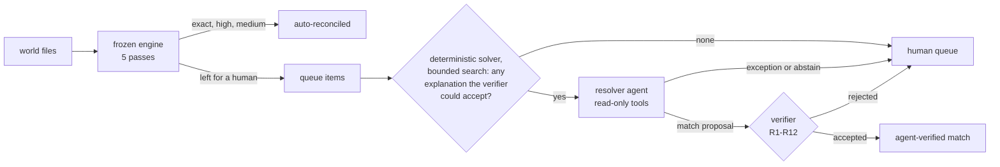

# Architecture

How the reconciliation loop works, where the AI agent sits in it, and where every number comes from: committed files
in [reports/](reports/), regenerated offline by `python scripts/repro.py`.

## Words used here

- **Settlement**: one Razorpay payout (payments minus fee and tax) sent to the bank with one **UTR**, the transfer
  reference and the strongest key joining it to a bank credit. **Paise**: all amounts are integer paise (₹1 = 100).
- **World**: one business's input files for a seed (one bank statement; held-out worlds split the settlements across
  2-4 merchant brands), plus its **golden files**: answer keys that engines and agents never read; graders do.
- **Queue item**: a record the engine left for a human. **Proposal**: the agent's one strict-JSON answer for it
  (`match`, `exception` or `abstain`). **Verifier**: code that shares nothing with what it checks.

## The data

`settlements.csv` and `bank_statement.csv` (messy narrations and rupee strings) feed settlement matching;
`payments.csv` and `order_book.csv` feed payment-to-order matching. Worlds from `src/recon/generate.py` (seed 42
committed) share an author with the engine, so they are not evidence; `src/recon/holdout.py` builds the held-out
worlds. `data/real/statement_a/` is one real personal bank statement with no Razorpay settlements in it: it tests
statement intake, not matching.

## The engine: five passes

`src/recon/engine.py`, frozen at git tag `engine-frozen` (`tests/test_engine_frozen.py` pins its bytes). Later passes
see only what earlier passes left unclaimed.

0. **Scope.** Debits are out of scope. Each credit gets reference tokens from its narration and
   `ref_no`, and is settlement-shaped if either carries a Razorpay marker or a UTR-shaped token.
1. **Exact UTR**, verbatim or with separators mangled. Equal amounts: `exact`. A gap explained by one of two hardcoded
   deductions (a ₹29.50 bank charge or 1% TDS, exactly what the generator injects): `high`. Several credits with the
   UTR: duplicates if each equals the net, a split if they sum to it exactly, otherwise all of them abstain.
2. **Damaged UTR.** A 10+ character fragment or a one-character corruption, with an equal amount.
3. **Merges.** A UTR-certain credit bigger than its settlement, if the leftover equals one other open settlement.
4. **Unique exact amount.** Settlement-shaped credits with no matching reference: exact paise equality within 10
   days, unique in both directions. Any tie and every party abstains.
5. **Residuals.** A UTR-certain pair with an unexplained gap becomes a `needs_review` match. The rest become exceptions
   with up to 3 nearest-miss candidates (settlement never reached the bank, credit with no settlement) or
   non-settlement credits.

`exact`, `high` and `medium` (unique amount) are auto-reconciled. `needs_review`, ambiguous, duplicate and missing
records go to the queue.

## The resolver: the agent proposes, the verifier disposes

`src/agent/resolve.py` walks the engine's queue, credit-side items first (by value date, id), then settlement-side (by
created date, id). The agent sees an allowlisted in-memory copy of `settlements.csv`, `bank_statement.csv` and
`settlement_merchants.csv`, never a golden file. Its first message and search tools leave out records the engine
already matched (`get_narration` still returns one by id, flagged `already_matched_by_engine`). The first message
carries the item, the engine's evidence and the open records in its window; the tools are `get_queue_item`,
`find_settlements`, `find_bank_credits`, `get_narration` and `submit_resolution`. One submission, no feedback, at most
4 API calls, the last of which can only submit. Items already covered by an earlier match proposal are skipped, and so
are items for which `src/agent/solver.py` finds no explanation the verifier could accept within its bounded search
(one credit with up to 6 settlements, one settlement split over 2-4 credits, 200,000 search nodes).

`src/agent/resolve_verifier.py` imports only the standard library, reads the raw files itself, and checks all match
proposals together after the run:

| Rule | A match is rejected unless |
|---|---|
| R1-R2 | the JSON is well-formed, every id exists, and bank rows are credits |
| R3-R4 | the queue item's records are in the proposal and none is already claimed |
| R5 | it pairs one credit with N settlements, or one settlement with N credits |
| R6 | settlement nets minus `deduction_paise` equal the credits, to the paisa |
| R7 | a deduction appears in the credit's narration as one money figure, quoted verbatim |
| R8 | each credit's value date is 0 to 10 days after each settlement's created date |
| R9 | each credit carries a Razorpay marker, a UTR-shaped token, or an identifier of a proposed settlement (its id, UTR or an 8+ character piece of it, or its merchant name) |
| R10 | no credit names a settlement, UTR or merchant outside the proposal |
| R11 | an identifier in the credit (settlement id, full UTR, a 10+ character piece of it, or the merchant name as written) rules out any same-amount rival that also fits |
| R12 | no two accepted proposals share a record |

R1-R8 are the brief's minimum and R9-R11 are stricter; R12 always runs. The reported result uses all twelve and also
scores the brief-minimum set (R1-R8 plus R12) on the same proposals. In the evaluation an accepted proposal replaces
the engine's decision under an `agent_verified` tier, and exceptions and abstentions stay with a human. The daily
close does not apply resolver answers yet.

## How it is measured

**Held-out set.** `src/recon/holdout.py` was written by a separate agent in a scratch folder holding only the
generator, schemas, loader and money helpers: no engine, no matching code, no docs, no agent code. Its brief told it
not to look elsewhere; that was an instruction, not a technical barrier (brief and folder builder in
`docs/provenance/`). Cases: narration-only deductions, settlements named by id or merchant, UTRs with 2+ characters
damaged, 3+ settlements merged into one credit, netted refunds and chargebacks, twins with and without a clue, and
negative controls. Narration templates come in two disjoint families: A for dev seeds 1000 and 1006 (all prompt work),
B for held-out seeds 1001-1005 (run once).

**Pre-registration.** `reports/preregistration.md` states the metrics, grading, item selection, verifier and crash
policy. `preregistration.json` pins code hashes in two steps: part 1 before any resolver run (verifier, solver,
grading code, holdout generator, engine) and part 2 before the held-out run (prompt, `resolve.py`, and the settings:
Claude Sonnet 5, effort medium). The grading code was amended twice, with recorded reasons: the provider switch before
the held-out run, and report-only fixes after it, which the report checks moved no number.

**Grading** (`src/agent/eval_resolve.py`), per golden row (a settlement or a bank credit): auto-resolved correctly,
auto-resolved wrongly (a wrong group, or an unexplained gap closed), or correctly or wrongly left for a human, with
Wilson 95% intervals. Same-data comparisons: engine alone, engine plus the no-model solver, a naive baseline, and
exact UTR then exact amount.

## Statement intake

`python -m agent.intake` gives an agent a raw export as a grid of strings; its only output is a strict mapping (header
row, column roles, date format, periods and noise rows, a reference recipe, reversal pairs). `src/agent/validator.py`
accepts it only if, in every period, opening balance plus credits minus debits reproduces the running balance row by
row, to the paisa. That proves rows and amounts, not which text column is the narration, so the look-alikes are also
graded on column roles against golden files. `--batch DIR` runs every file with at most 3 attempts;
`reports/intake_eval.md` has a table for real files and one for look-alikes built by an agent that never saw the code.

## The daily close

`src/controller/close.py` runs the engine once and triages what needs a human into one queue: S1 act today (settlement
never reached the bank, duplicate credit), S2 chase (ambiguous, credit with no settlement, payment breaks), S3 review
(unexplained residuals, unpaid orders, payments with no order). `verify_close.py` re-checks a close from its JSON;
`audit.py` scores the queue against golden files. Operator actions are an append-only trail in `data/state/`.

## Runtime and replay

`src/agent/loop.py` is a hand-written, bounded tool-use loop. `provider.py` (Anthropic: the resolver runs, the
single-statement intake and the investigator) and `gemini.py` (Gemini REST: the batch intake runs) are interchangeable
transports. Live runs write a JSONL transcript with the SHA-256 of every request the loop builds (prompt, tools, tool
results, history); replay serves the recorded responses and fails loudly if that request differs. Transport settings
(model, effort, Gemini options) are outside the hash; the pre-registration pins them from each transcript's first
line. `pricing.py` stops resolver and batch-intake runs once spend reaches `AGENT_MAX_USD` (default 10, list prices,
checked before each call). A spend cap, daily quota or provider outage stops them cleanly, and `--resume` (or
rerunning the batch) picks up. The dashboard never calls an API.

## Module map

| Module | Job |
|---|---|
| `recon/engine.py`, `normalize.py`, `io_load.py`, `leg_b.py`, `journey.py`, `explain.py` | the frozen engine, its parsers and loader; payment-to-order matching, order journeys, explanation text |
| `recon/generate.py`, `holdout.py`, `benchmark.py`, `baselines.py`, `verify.py` | regression and held-out worlds; grading, baselines, engine verifier |
| `agent/resolve.py`, `resolve_verifier.py`, `solver.py`, `eval_resolve.py` | resolver, verifier, solver, grading |
| `agent/intake.py`, `intake_batch.py`, `validator.py`, `mapping.py`, `rawgrid.py`, `cells.py`, `apply.py` | statement intake, its balance-chain check, mapping schema, grid and cell parsing |
| `agent/loop.py`, `provider.py`, `gemini.py`, `pricing.py`, `investigate.py` | loop, transports, budget; the investigator (read-only tools, an advisory note on a queue item, decides nothing) |
| `controller/`, `ingest/` | daily close and queue; Razorpay files, API pull, webhooks |
| `app.py`, `scripts/repro.py` | the dashboard; offline reproduction of every number |
