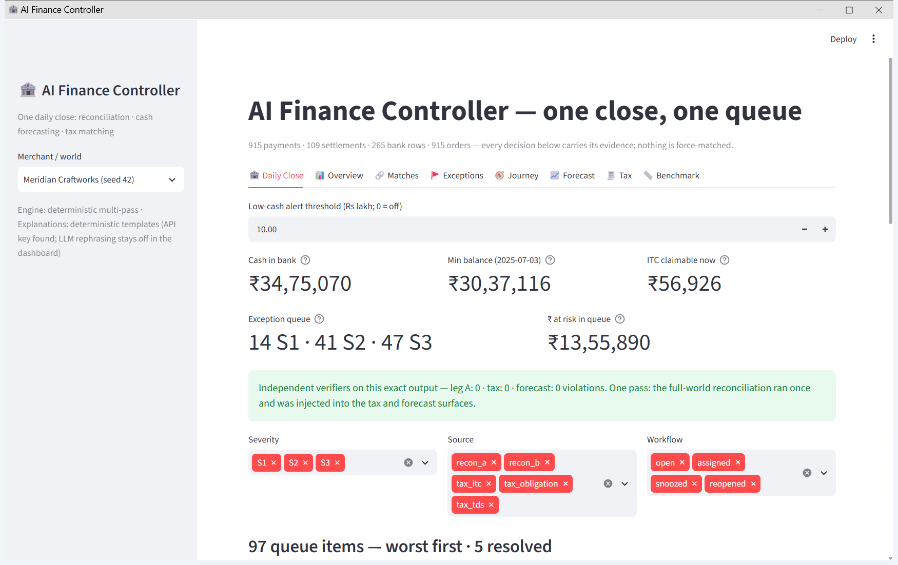

# AI Finance Controller

**Razorpay Buildathon, Track 04.** A daily close for a Razorpay merchant: reconcile the money, forecast the cash, check the tax, and put everything that needs a human into one ranked queue. A rules engine makes every money decision; an AI agent is used only for the messy parts, and arithmetic proves its output before anything is written.

## For reviewers

- **The deliverable (the brief's own metric).** On the committed 180-day world, **202 of 238 settlement-side records auto-reconciled (84.9%)**, and the other **36 became a ranked exception queue** rather than forced matches. An independent verifier recomputes both numbers from the decisions embedded in the close. Full breakdown in [Results](#results).
- **Run it in one command.** `pip install -r requirements.txt -r requirements-dev.txt -e .` then `streamlit run src/app.py`. The dashboard opens at http://localhost:8501. No API key, no network, no database. Python 3.11 or newer.
- **The real evidence is the gap to a naive baseline,** run through the same parsers and grader. It gets 79.2% reconciliation recall and claims ₹1,65,084 of tax credit it is not entitled to; this engine refuses every ambiguous case and claims ₹0 falsely. See [Reading the 100% honestly](ARCHITECTURE.md#reading-the-100-honestly).
- **Jump to:** [Results](#results) · [How it works](#how-it-works) · [What is real and what is synthetic](#what-is-real-and-what-is-synthetic) · [Full design (ARCHITECTURE.md)](ARCHITECTURE.md)



*The Daily Close on the committed world: cash, the forecast low, tax credit claimable, the queue worst-first, and the verifiers' verdict on this exact output.*

## Where everything lives

| | |
|---|---|
| [ARCHITECTURE.md](ARCHITECTURE.md) | the full design: every module, the engine pass order, stage-by-stage results, the agent layer, honest scope |
| [reports/](reports/) | committed benchmark evidence, regenerated by `python scripts/repro.py` |
| [src/](src/) | `recon/` reconciliation · `forecast/` · `tax/` · `controller/` daily close and queue · `agent/` · `ingest/` Razorpay adapters · `app.py` dashboard |
| [tests/](tests/) | 323 tests; [CI](.github/workflows/tests.yml) runs the whole offline suite on every push |
| [data/](data/) | committed world (`seeds/42`), real statement (`real/statement_a`), Razorpay fixtures (`fixtures/razorpay`), merchant registry, recorded agent transcripts |
| [LICENSE](LICENSE) | MIT |

## What it does

Every morning a finance team wants three answers: how much cash is in the bank, is anything going to drop in the next two weeks, and what needs a human today. This project produces that screen from six input files and proves its own work.

1. **Reconciliation.** Match every Razorpay settlement to the bank credit that carried it, and every payment to its order. When the evidence cannot separate two candidates, it says so instead of guessing.
2. **Cash forecast.** A 14-day balance path built from money already captured, recurring bills detected from history, and plain weekday statistics for the rest.
3. **Tax matching.** Check that every input credit you plan to claim was actually filed by the vendor (GSTR-2B), that tax deducted from you shows up in Form 26AS, and that GST and TDS were paid on time and in full.

Everything that needs a human lands in **one queue, ranked by consequence**, with the money at risk and a suggested action on each item.

## Run it

```
pip install -r requirements.txt -r requirements-dev.txt -e .
streamlit run src/app.py
```

The dashboard opens at http://localhost:8501. No API key, no network, no database. Python 3.11 or newer.

To regenerate every number in this repo from a clean checkout (323 tests, all benchmarks, the real-statement run, fully offline):

```
python scripts/repro.py
```

`scripts\repro.ps1` on Windows and `scripts/repro.sh` on Linux and macOS wrap the same script.

## Results

All numbers are regenerated by `scripts/repro.py` and frozen in [reports/](reports/). Each engine is graded on this project's own synthetic worlds, where the correct answer is written at generation time, next to a naive baseline run through identical parsing and grading.

| Stage | This project | Naive baseline |
|---|---|---|
| Reconciliation: precision / recall / correct label | **100% / 100% / 100%**, 30 of 30 ambiguous cases correctly refused | 97.5% / 79.2% / 74.1%, 0 of 30 refused |
| Cash forecast: balance error / 80% band coverage / cash-drop alerts | **₹76,454 (1.7% of opening balance) / 80.3% / 17 of 21 caught, 2 false alarms** | ₹1,83,033 (4.0%) / none / 0 of 21 caught |
| Tax matching: correct label / credit claimed falsely | **100% / ₹0** | 51.3% / ₹1,65,084 |
| Unified queue: recall / precision / verifier violations | **1266 of 1266 / 100% / 0** | 83.1% / 48.1% / 330 |
| Real bank statement (65 messy rows) | **balance chain proven to the paisa; engine claimed nothing** | not applicable |

The brief asks for a match rate and the exceptions that could not be resolved. On the committed 180-day world, **202 of 238 settlement-side records auto-reconciled (84.9%)**, and **36 could not be resolved automatically and went to the queue**: 6 ambiguous, 9 duplicate bank credits, 16 settlements that never reached the bank, 5 bank credits with no settlement (`reports/daily_close_42d180.md`).

**The 100% is not the headline; the gap to the naive baseline is.** The first script anyone writes (amount within ₹1, value date within 3 days, first match wins, no references) gets 79.2% recall and forces every one of the 30 ambiguous cases; this engine refuses all 30. The 100% itself means one thing: the engine saturates our synthetic test set, including the cases built to be undecidable where the correct move is to abstain. It is not a claim about real-world accuracy, which was never measured. [Reading the 100% honestly](ARCHITECTURE.md#reading-the-100-honestly) gives the full treatment; [What is real and what is synthetic](#what-is-real-and-what-is-synthetic) gives the scope.

## How it works

**Verification is the bottleneck, so the AI is quarantined.** The track brief quotes the 2026 builder consensus: verification capacity, not generation speed, is what is scarce. So no LLM ever touches a money decision. The agent is used only where the input is genuinely fuzzy (reading a raw bank export, drafting an investigation note), it can only *propose*, and deterministic arithmetic must prove its proposal before anything is written. The intake agent reads any messy bank export and proposes its structure (where the header is, which column is which, where each statement period starts and ends); a validator accepts it only if opening balance plus credits minus debits reproduces the running balance row by row to the paisa. On the committed real statement, `data/real/statement_a/`, the agent's first proposal was rejected and its second passed, and the recording replays offline with no API key. The investigator agent is the same shape: read-only tools, and its only output is an advisory note on a queue item (one real run committed, 3 API calls, about $0.04). No decision module imports the agent package, checked by test, and engine decisions are byte-identical with the agent layer present or absent.

**Reconciliation is evidence-first.** A match rests on the bank transfer reference (UTR) appearing in the bank narration, or on exact-paise amount equality that is unique in both directions. Never on "close enough". Five passes run in order, each seeing only what earlier passes left unclaimed: exact UTR, damaged UTR with exact amount, merged credits, unique exact amount, then honest exceptions. Every decision carries its evidence. Every exception carries the candidates that were considered and why each was rejected.

**Abstaining is a real answer.** When two settlements have the same amount to the paisa and the bank credit carries no reference, the engine shows a human both and refuses to pick. The benchmark rewards this and scores a forced guess as a false match.

**Everything is checked by someone else.** Four verifiers share no code with the engines. They re-read the raw files with their own parsers and fail the run on any violation: a record claimed twice, an amount that does not sum, a confidence tier without its evidence, a close that misreports its own trust panel.

## What is real and what is synthetic

Read this before trusting the numbers.

- **The data is synthetic, by design.** The brief defines Track 04 as closing a finance-ops loop "across a 50+ record batch of synthetic data". Every graded number comes from worlds built by `src/recon/generate.py`; the one real file is a bank statement, `data/real/statement_a/`. The engine has never run on real Razorpay settlement data. On that real statement it correctly claimed nothing (a personal account with no settlements), which shows it does not force matches, not matching accuracy.
- **Real data is out of reach, not skipped.** Razorpay test mode cannot produce settlements: it moves no real money, settling is a live-mode function ([Test and Live Modes](https://razorpay.com/docs/payments/dashboard/test-live-modes/)), and tested hands-on in August and September 2026, test-mode settlement entries only ever showed "failed". GSTR-2B and Form 26AS need a business's own GST and income-tax logins. So the `src/ingest/` adapters run against official-schema fixtures and those tax files are generated too.
- **The daily forecast is not day-precise.** Daily net-flow error (WAPE) is 59%, because the series is spiky by construction. What a cash planner uses is the balance path (within 1.7% of opening balance on average), the 14-day low (within ₹30,041), and the cash-drop alerts (17 of 21 caught, 2 false alarms across 70 held-out fortnights). The 80% band covers 80.3% on average but 53% to 97% per world. Full breakdown in [ARCHITECTURE](ARCHITECTURE.md#stage-2-cash-forecasting).
- **Scale is untested.** Throughput is measured (thousands to tens of thousands of records per second on one laptop) but only over small worlds, single process, never production volumes.

## Commands worth trying

```
python -m controller.close data/seeds/42 --report              # one daily close
python -m controller.close data/seeds/42 --as-of 2025-06-30 --snapshot
python -m controller.close data/seeds/42 --snapshot --report   # adds a "since last close" delta
python -m controller.close --merchants data/merchants.json     # every merchant in the registry
python -m controller.queue_state data/seeds/42 list            # act on queue items from the CLI
python -m tax.gstr1 data/seeds/42 --report                     # GSTR-1 sales summary
python -m agent.intake data/real/statement_a/statement.xlsx --out out/w --mapping data/real/statement_a/world/mapping.json --report
```

Optional: put an `ANTHROPIC_API_KEY` in `.env` (template provided) to run the agents live. `agent.intake --record` maps a new bank export and records the transcript. `agent.investigate --record` drafts a note on a queue item. Decisions are unaffected in every mode, by test.
