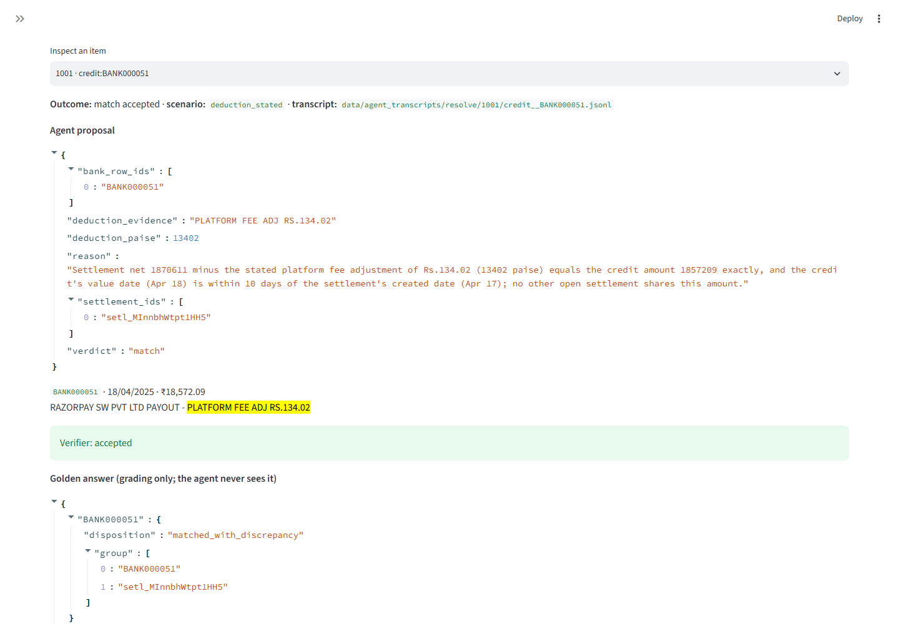

# AI Finance Controller

Reconciles Razorpay settlements against the bank statement. A frozen rules engine matches what it can prove, a Claude agent proposes answers for the exceptions the engine leaves, and an independent arithmetic verifier accepts a proposal only if the money adds up to the paisa.

**Live demo:** _link coming after deployment_ (the app needs no API key: it replays the recorded agent runs).

**60-second demo GIF:** _coming_. Until then, a still of the Agent resolutions tab:



## Results on an independent held-out set

241 case rows (one per settlement and per bank credit) across five worlds, written by a separate agent that never saw the engine, the agent or the verifier. The engine was frozen, and the prompt, model and settings were [pre-registered](reports/preregistration.md) before this set was run, once.

| Metric | Engine only | Engine + agent |
|---|---|---|
| Auto-resolved correctly | 40 | 131 |
| Auto-resolved wrongly | 0 | 0 |
| Correctly abstained | 70 | 70 |
| Wrongly abstained (left for human) | 131 | 40 |
| Agent proposals rejected by verifier | n/a | 0 |
| **Wrong proposals the verifier accepted** | n/a | **0** |
| Cost per item (USD), median latency (s) | n/a | $0.0101 billed · 6.82 s |

Claude Sonnet 5 (effort medium) was sent 35 queue items and proposed 35 matches, and the verifier accepted all 35. It closed every stated deduction (30 rows), chargeback (10), refund (10) and multi-settlement merge (41). Every never-paid settlement, orphan credit, unstated deduction and clue-less twin stayed with a human, as the answer key says it should. The whole held-out run cost $0.35. For comparison, the engine plus a deterministic solver behind the same verifier, with no LLM, resolves 74 rows correctly. A naive amount matcher gets 56 right and 32 wrong, and exact-UTR-then-amount gets 62 right and 28 wrong. The per-scenario tables, ablations and the 10 worst failures are in [reports/agent_eval.md](reports/agent_eval.md).

## Run it

```bash
pip install -r requirements.txt -e . && streamlit run src/app.py
```

Opens at http://localhost:8501. Every number above regenerates from the recorded transcripts with `python scripts/repro.py`, with no API key. Its first step pip-installs the pinned requirements, including pytest; after that, `python scripts/repro.py --skip-install` needs no network. Measured speeds (records per second) differ from run to run; nothing else does.

## Limits

- **The data is synthetic.** Every reconciliation number comes from generated worlds. The held-out worlds were written independently, but they are still synthetic. A reviewer found one known tell: every merged-group settlement, and 16 of the 28 clue-less twins, is created on a weekend, against 20% of the other settlements. It changes no answer. The engine has never run on real Razorpay settlements, because Razorpay test mode cannot produce them.
- **40 held-out rows that have an answer still go to a human.** 30 involve equal-amount twin settlements whose bank lines name the right one in a form the verifier does not accept: a merchant name without spaces, or only the UTR's last five digits. Even the correct answer fails it. The other 10 are returned outward NEFT payments; the engine does not recognise their wording, and the resolver can only answer match, exception or abstain. The rules were frozen before this showed up, so it is reported rather than patched.
- **The agent is measured, not yet wired into the daily close.** Accepted answers are applied in the evaluation and shown in the dashboard's Agent resolutions tab. The daily close and its queue still show only the engine's decisions.
- **Much of the gain is arithmetic, and it was measured once.** The engine plus the deterministic solver reaches 74 of the 131, so the LLM's own margin is the other 57 rows. That comes from one run of one model, with no rerun variance.
- **Statement intake is barely tested on real files.** It was run on one real statement, which passed on the second attempt. On 15 synthetic bank-format look-alikes, 4 pass. 9 cannot pass at all, because the mapping schema has no single Amount + Dr/Cr column and no summary-line balances ([reports/intake_eval.md](reports/intake_eval.md)).

Design and pass order: [ARCHITECTURE.md](ARCHITECTURE.md). The engine alone, on this project's own generated worlds: [reports/benchmark_report.md](reports/benchmark_report.md). MIT licensed.
